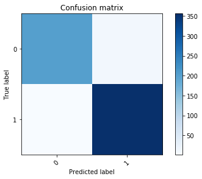
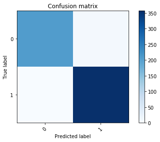
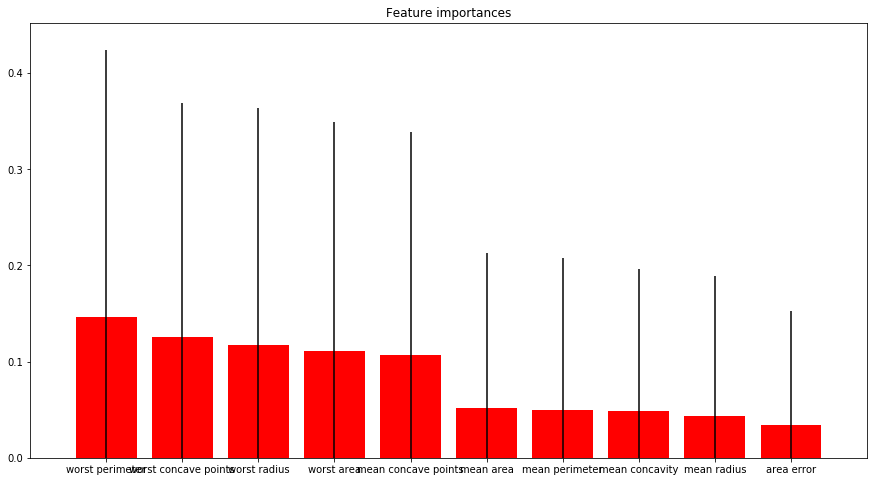
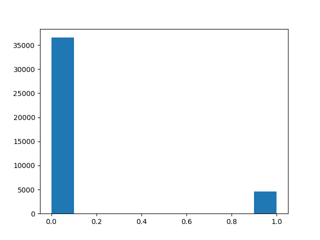

# Breast cancer data analysis

**Is it required to do standardization?** A box plot has been created for the data. It has shown that there is a huge variance in some median values, that requires to use standardization.

After fitting the model on all the data except the last one, it appeared that the last patient had a positive result for the prediction on the 30 features available.

After applying the confusion matrix method to the predicted results and the original results, it appeared that true positive were more than true negatives, both false negatives and positive had very few cases.

Confusion matrix for SVM

Confusion matrix for DT

Fold test accuracy showed results varying between 62% and 100% and with average accuracy 94%. Best gamma value chosen was 1e-05 with C value 1000 for 97% accuracy, the same gama and C values were selected for other higher accuracy values.

Similar results of confusion matrix were achieved via decision trees.

Feature importances for decision tree

## After standadization
After doing the standardization, folds test gave higher accuracy values for SVM, the average accuracy value was 97%. C value was less, which refers to a better decision function performance. Gamma value was higher after doing standardization, which refers to less effect of single sample on the general performance.

Decision tree has not been affected by the standardization.
# Bank data analysis
Null values were removed, as long as the unwanted columns, the data frame then was saved at a dummies object. 

The data later were divided into test and training, and an Artificial Neural Network Classifier was used. Confusion matrix was applied to the results as follows:

The accuracy during the 10 folds test has exceeded 99% for all folds.

